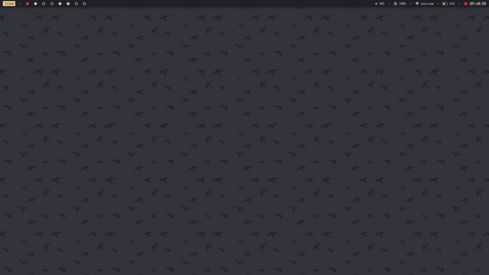
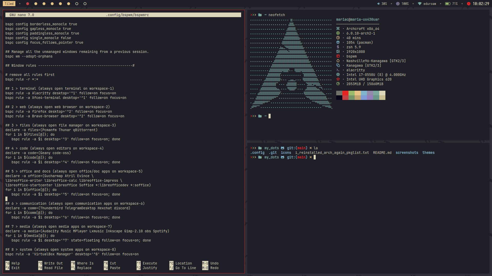
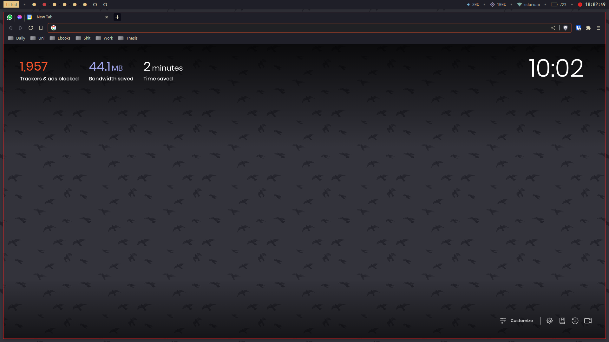
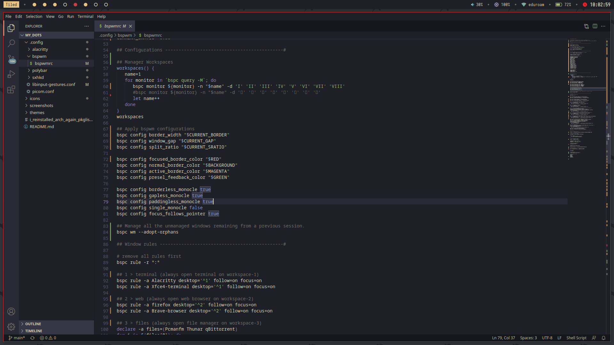

<h2 align="center"> ━━  my dots  ━━ </h2>

<!-- Preview -->
###  Preview

Desktop:

   

Tiled Usage:

 
 

Firefox:

  

Code:

  

---

<!-- INFORMATION -->
###  Information

   Welcome visitor,
   
   This is my dots repository!
   
   In other words, it is where I keep my configs in case I decide to reinstall my setup.
   
   Keep in mind that I am using Archcraft, which is a distro that has a lot of configurations already built in. I just change the overall theme to my liking.
   
   The configurations for rofi, dunst, picom, etc. are the ones used in Archcraft.

   - **WM:** [bspwm](https://github.com/baskerville/bspwm)
   - **OS:** [Archcraft](https://archcraft.io/)
   - **Terminal:** [alacritty](https://github.com/alacritty/alacritty)
   - **Panel:** [polybar](https://github.com/polybar/polybar/)
   - **Compositor:** [picom](https://github.com/yshui/picom)
   - **Editor:** [geany](https://www.geany.org/)
   
---

###  Look and Feel Packages

   - **GTK Theme**
      > [Nashville96-Kanagawa](https://github.com/donfaustinocortizone/Nashville96)

   - **Icon Theme**
      > [Kanagawa](https://store.kde.org/p/1810565)

### Acknowledgements

   - **Inspiration**
      - [janleigh](https://github.com/janleigh/dotfiles) (README structure)
      - [bwyx](https://github.com/bwyx/dotfiles) (polybar)
      - [FhilipeCrash](https://github.com/FhilipeCrash/Dotfiles) (polybar)
      - [Nashville96-Kanagawa](https://github.com/donfaustinocortizone/Nashville96) (colorscheme and aesthetic)
